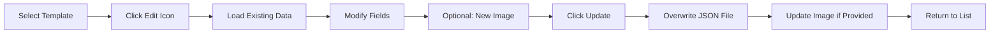
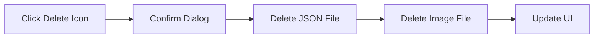
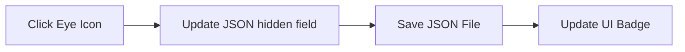

# Map Poster Template System - Complete Documentation

## Table of Contents
1. [Overview](#overview)
2. [Architecture](#architecture)
3. [File Structure](#file-structure)
4. [Components](#components)
5. [API Endpoints](#api-endpoints)
6. [Workflows](#workflows)
7. [Image Processing](#image-processing)
8. [Security](#security)
9. [Troubleshooting](#troubleshooting)

---

## Overview

The Map Poster Template System is a comprehensive solution for managing pre-designed map templates that users can quickly customize. It provides an admin interface for template management and a public gallery for template selection.

### Key Features
- **Template Gallery**: Public-facing page with compact card design
- **Dual Editor System**: Basic editor for quick personalization, advanced for full control
- **Admin Panel**: Password-protected interface for template management
- **Smart Routing**: Templates open in basic editor by default
- **Folder-Based Storage**: Templates stored as individual JSON files with separate images
- **Session Management**: Persistent login sessions using localStorage
- **CRUD Operations**: Create, Read, Update, Delete templates
- **Visibility Control**: Hide/show templates from public view
- **Automatic ID Generation**: Sequential template IDs (template-1, template-2, etc.)

---

## Architecture

### System Design
```
┌─────────────────────┐     ┌──────────────────┐     ┌──────────────────┐
│   Client (React)    │────▶│  Server (Express)│────▶│   File System    │
│                     │◀────│                  │◀────│                  │
└─────────────────────┘     └──────────────────┘     └──────────────────┘
         ▲                            │                        │
         │                            │                        ▼
         │                            │               ┌──────────────────┐
         └────────────────────────────┼──────────────▶│  Public Assets   │
                                      │               │  - Images        │
                                      │               │  - JSON Files    │
                                      └──────────────▶└──────────────────┘
```

### Technology Stack
- **Frontend**: React, TypeScript, TailwindCSS, Lucide Icons
- **Backend**: Express.js, Node.js
- **Storage**: File system (JSON files + images)
- **State Management**: React hooks, localStorage for session
- **Build Tool**: Vite

---

## File Structure

### Directory Layout
```
/client/
├── public/
│   ├── template-previews/          # Template preview images
│   │   ├── template-1.jpg          # 600x800px optimized JPEG
│   │   ├── template-2.jpg
│   │   └── ...
│   └── templates/
│       └── json/                   # Template JSON data files
│           ├── template-1.json     # Complete template configuration
│           ├── template-2.json
│           └── ...
├── src/
│   ├── pages/
│   │   ├── template-generator.tsx  # Admin panel for template management
│   │   └── map-templates.tsx       # Public template gallery
│   └── lib/
│       └── mpg/
│           └── MPG-templates.ts    # Template loader and utilities
└── server/
    └── routes/
        └── save-template.ts        # API endpoints for template operations
```

### JSON File Structure
Each template is stored as a JSON file with this structure:
```json
{
  "id": "template-1",
  "name": "Where we met - New York",
  "city": "New York",
  "style": "chalkboard",
  "hidden": false,
  "thumbnail": "/template-previews/template-1.jpg",
  "jsonData": {
    "version": "1.0",
    "created": "2025-08-26T18:48:38.644Z",
    "application": "YourMapArt",
    "snapshot": {
      "location": { /* lat, lng, zoom, etc. */ },
      "text": { /* headline, city, coordinates, etc. */ },
      "style": { /* mapStyle, frame, colors, etc. */ },
      "export": { /* format, size, quality */ }
    }
  }
}
```

---

## Components

### 1. Template Generator (`/template-generator`)
**Location**: `/client/src/pages/template-generator.tsx`

#### Features:
- **Authentication**: Password protection (password: `1980`)
- **Session Management**: 2-hour sessions stored in localStorage
- **View Modes**: 
  - List view: Shows all templates with thumbnails
  - Create view: Form for new templates
  - Edit view: Modify existing templates

#### UI Elements:
- **List View**:
  - Template cards with thumbnail previews
  - Edit button (pencil icon)
  - Hide/Show toggle (eye/eye-off icon)
  - Delete button (trash icon)
  
- **Create/Edit Form**:
  - Template ID (auto-generated or existing)
  - Template Name field
  - JSON Data textarea with validation
  - Image upload with preview
  - Save/Cancel buttons

### 2. Map Templates Gallery (`/map-templates`)
**Location**: `/client/src/pages/map-templates.tsx`

#### Features:
- Public-facing template gallery
- Filters out hidden templates
- Click to use template functionality
- Responsive grid layout (1-3 columns)

#### UI Elements:
- Template cards with preview images
- Template name and city
- Style indicator
- "Use This Template" button
- Quick Start navigation

### 3. Template Loader Module
**Location**: `/client/src/lib/mpg/MPG-templates.ts`

#### Functions:
- `loadTemplates()`: Fetches all templates from server
- `getTemplateById()`: Retrieves specific template
- `getTemplateData()`: Gets template JSON data
- `updateTemplateData()`: Client-side template update

---

## API Endpoints

### Base Routes
All template-related endpoints are in `/server/routes/save-template.ts`

### 1. GET `/api/get-templates`
**Purpose**: Retrieve all templates from the file system

**Response**:
```json
{
  "templates": [
    {
      "id": "template-1",
      "name": "Template Name",
      "city": "City Name",
      "style": "map-style",
      "hidden": false,
      "thumbnail": "/template-previews/template-1.jpg",
      "jsonData": { /* full template data */ }
    }
  ]
}
```

### 2. POST `/api/save-template`
**Purpose**: Create or update a template

**Request Body**:
```json
{
  "template": {
    "id": "template-1",
    "name": "Template Name",
    "city": "City",
    "style": "style",
    "hidden": false,
    "jsonData": { /* template configuration */ }
  },
  "imageData": "data:image/jpeg;base64,..." // Optional for updates
}
```

**Response**:
```json
{
  "success": true,
  "message": "Template saved successfully",
  "templateId": "template-1"
}
```

### 3. POST `/api/toggle-template-visibility`
**Purpose**: Hide or show a template from public view

**Request Body**:
```json
{
  "templateId": "template-1",
  "hidden": true
}
```

### 4. DELETE `/api/delete-template`
**Purpose**: Remove a template completely (JSON + image)

**Request Body**:
```json
{
  "templateId": "template-1"
}
```

---

## Workflows

### User Experience Flow (NEW)

#### Basic Editor Flow (Default)
```mermaid
flowchart LR
    A[Browse Templates] --> B[Click "Personalize This"]
    B --> C[Basic Editor Opens]
    C --> D[Enter Text Fields]
    D --> E[Choose Size]
    E --> F[Download PNG]
    C --> G[Optional: Open Advanced Editor]
    G --> H[Full Customization]
```

**Steps**:
1. User browses template gallery at `/map-templates`
2. Clicks "Personalize This" button on any template
3. Navigates to `/personalize-map?template={id}`
4. Page 1: Enters location, headline, and message (4 fields only)
5. Page 2: Selects from 3 sizes and downloads
6. Optional: Can switch to advanced editor with state preserved

#### Advanced Editor Access
- **Direct URL**: `/map-poster-generator`
- **From Basic Editor**: "Open Advanced Editor →" link
- **State Preservation**: All changes carry over between editors

### 1. Creating a New Template

```mermaid
flowchart LR
    A[Login to Admin] --> B[Click Create New]
    B --> C[Paste JSON Data]
    C --> D[Auto-fills Name & City]
    D --> E[Upload Preview Image]
    E --> F[Image Optimization]
    F --> G[Click Add Template]
    G --> H[Save JSON to /templates/json/]
    H --> I[Save Image to /template-previews/]
    I --> J[Redirect to List View]
```



**Steps**:
1. Admin logs in with password `1980`
2. Clicks "Create New Template"
3. Pastes template JSON data
4. System auto-generates:
   - Template ID (e.g., template-2)
   - Name from headline + city
5. Uploads preview image
6. Image is optimized to 600x800px
7. Clicks "Add Template"
8. System saves:
   - JSON file to `/public/templates/json/`
   - Image to `/public/template-previews/`
9. Redirects back to list view

### 2. Editing a Template



**Features**:
- Loads existing JSON data
- Image upload is optional
- Preserves template ID
- Updates both JSON and image if needed

### 3. Deleting a Template



**Process**:
1. Admin clicks trash icon
2. Confirmation dialog appears
3. On confirm:
   - Deletes `/templates/json/template-X.json`
   - Deletes `/template-previews/template-X.jpg`
4. UI refreshes automatically

### 4. Toggle Visibility



**Behavior**:
- Eye icon = template is visible
- Eye-off icon = template is hidden
- Hidden templates show "Hidden" badge
- Hidden templates don't appear in public gallery

---

## Image Processing

### Upload Process
1. **File Selection**: User selects image file
2. **Client-side Preview**: FileReader creates data URL
3. **Optimization** (on save):
   ```javascript
   // Target dimensions
   const targetWidth = 600;
   const targetHeight = 800;
   
   // Scale to cover entire canvas
   const scale = Math.max(targetWidth / img.width, targetHeight / img.height);
   
   // Center the image
   const x = (targetWidth - scaledWidth) / 2;
   const y = (targetHeight - scaledHeight) / 2;
   ```

### Image Specifications
- **Format**: JPEG
- **Dimensions**: 600x800 pixels (3:4 aspect ratio)
- **Quality**: 85% compression
- **File Size**: Typically 50-150KB after optimization
- **Storage**: `/client/public/template-previews/`

### Processing Steps
1. Convert uploaded file to base64
2. Create canvas element (600x800)
3. Scale image to cover canvas
4. Center image if aspect ratio differs
5. Export as JPEG with 0.85 quality
6. Save to file system

---

## Security

### Authentication
- **Password Protection**: Admin panel requires password
- **Password**: `1980` (hardcoded)
- **Session Duration**: 2 hours
- **Session Storage**: localStorage with expiry timestamp

### Session Management
```javascript
const SESSION_KEY = 'template-generator-auth';
const SESSION_DURATION = 2 * 60 * 60 * 1000; // 2 hours

// Create session
const sessionData = {
  authenticated: true,
  expiry: Date.now() + SESSION_DURATION,
};
localStorage.setItem(SESSION_KEY, JSON.stringify(sessionData));
```

### Security Considerations
- No user accounts system
- Single shared admin password
- Session persists across browser refreshes
- Manual logout available
- No server-side session validation

---

## Troubleshooting

### Common Issues

#### 1. Template Image Not Showing
**Cause**: Missing thumbnail field in JSON
**Solution**: Ensure JSON includes `"thumbnail": "/template-previews/template-X.jpg"`

#### 2. Delete Only Removes Image
**Cause**: Old system behavior
**Solution**: New system removes both JSON and image files

#### 3. Auto-Logout Issues
**Cause**: Page reloads clearing state
**Solution**: Session now stored in localStorage, persists across reloads

#### 4. Template Not Appearing
**Check**:
- JSON file exists in `/templates/json/`
- Image file exists in `/template-previews/`
- Template not marked as `hidden: true`
- Server restarted after changes

#### 5. Large Image Upload Fails
**Cause**: Express body parser limit
**Solution**: Server configured with 10MB limit:
```javascript
app.use(express.json({ limit: '10mb' }));
```

### File Permissions
Ensure proper permissions for:
- `/client/public/templates/json/` (write access)
- `/client/public/template-previews/` (write access)

### Server Logs
Monitor server console for:
- "Saving template: [id]"
- "Saved JSON to: [path]"
- "Saved image to: [path]"
- "Deleting template: [id]"
- Error messages

---

## Future Enhancements

### Potential Improvements
1. **Database Storage**: Move from file system to database
2. **User Accounts**: Individual admin accounts
3. **Template Categories**: Organize by style/theme
4. **Bulk Operations**: Select multiple templates
5. **Template Versioning**: Track changes over time
6. **API Authentication**: Token-based auth
7. **CDN Integration**: Serve images from CDN
8. **Template Search**: Search by name, city, style
9. **Template Analytics**: Track usage statistics
10. **Template Sharing**: Export/import templates

### Scalability Considerations
- Current system suitable for <1000 templates
- File system approach simple but limited
- Consider database for larger scale
- Image CDN for better performance
- Caching layer for frequent requests

---

## Maintenance

### Regular Tasks
1. **Backup Templates**: Copy `/templates/json/` folder
2. **Backup Images**: Copy `/template-previews/` folder
3. **Clean Orphaned Files**: Remove images without JSON
4. **Monitor Disk Space**: Check image folder size
5. **Update Dependencies**: Keep packages current

### Migration Guide
To move templates to new system:
1. Copy all JSON files to `/templates/json/`
2. Copy all images to `/template-previews/`
3. Ensure JSON files include thumbnail field
4. Test each template loads correctly
5. Verify hidden status preserved

---

## Contact & Support

For issues or questions about the template system:
- Check server logs for errors
- Verify file permissions
- Ensure all paths are correct
- Review this documentation

**System Created**: August 2025
**Last Updated**: August 26, 2025
**Version**: 1.0.0